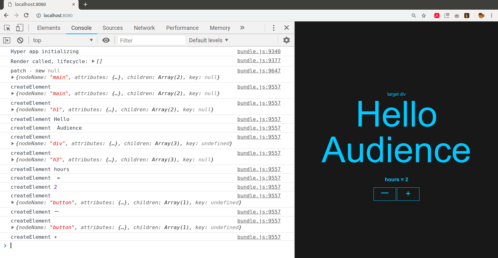

# talk-hyperapp

Tech talk about how Javascript frameworks work, using
[HyperApp](https://github.com/jorgebucaran/hyperapp) as an example.

Dirk P. Janssen, Dec 2018

## In this repo
- org-mode file with talk slides (talk-hyperapp.org)
- PDF text handout from slides (talk-hyperapp.pdf)
- 'traced/hyperapp.js' with all HyperApp source code (renamed from
  hyperapp's :src/index.js:)
- 'traced' directory with working simple HyperApp Application
- 'traced' directory has JSX/Babel/Webpack setup that you can use in
   your own projects

## Resources

- [Hyperapp on Github](https://github.com/jorgebucaran/hyperapp)
- [List of HyperApp examples, talks and demos](https://github.com/hyperapp/awesome-hyperapp)

